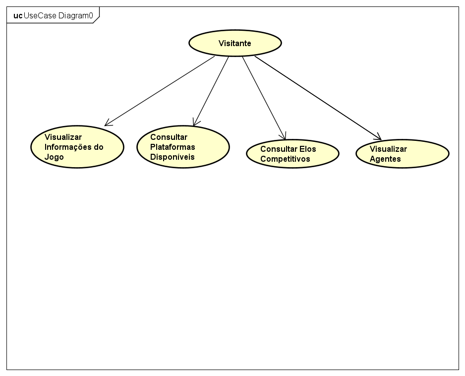
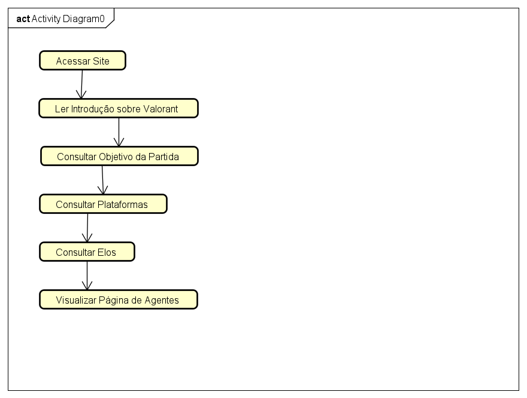
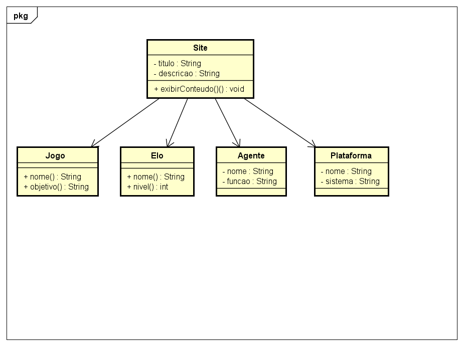

# Requisitos de Sistema - Modelagem UML

Esta pasta reúne os requisitos de sistema e a modelagem UML do site informativo
sobre Valorant. Os diagramas foram produzidos no Astah e representam as
funcionalidades, o fluxo de navegação e a estrutura conceitual do projeto.

## Arquivos

- [Requisitos de Sistema](Requisitos%20de%20sistema.md)
- [Projeto Astah UML](Projeto_Astah_Squad.asta)

## 1. Diagrama de Casos de Uso

O diagrama apresenta o ator **Visitante** e as principais consultas disponíveis
no site: informações do jogo, plataformas, elos competitivos e agentes.

## 2. Diagrama de Atividades

O diagrama representa o fluxo principal de navegação do visitante, desde o
acesso ao site até a visualização da página de agentes.

## 3. Diagrama de Classes

O diagrama apresenta as classes conceituais **Site**, **Jogo**, **Elo**,
**Agente** e **Plataforma**, com seus principais atributos, operações e
relacionamentos.

